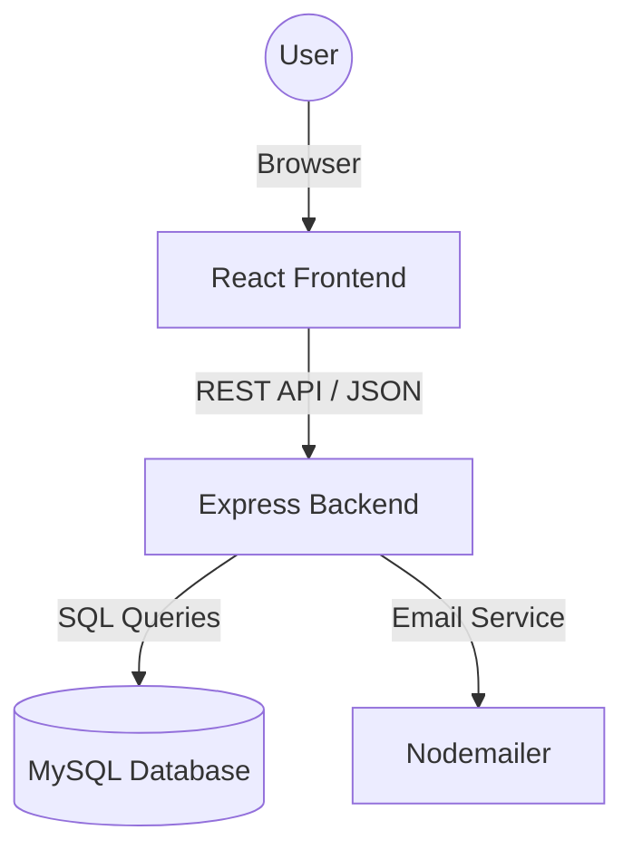
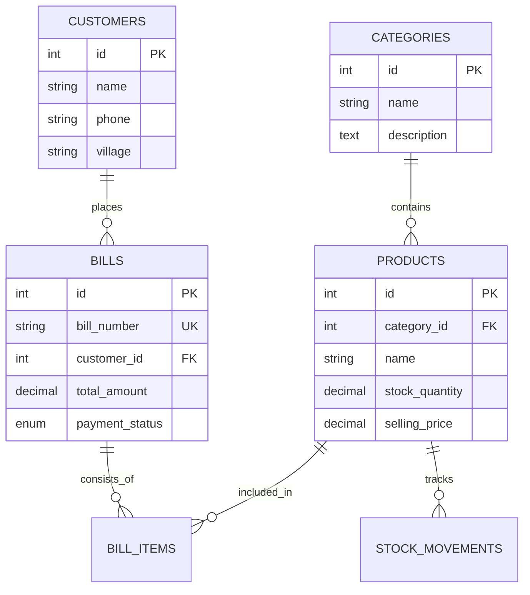

# Krushi Seva Kendra Billing System - Complete Documentation

A modern, high-performance billing and inventory management system designed for agricultural service centers.

---

## 📖 Table of Contents
1. [Project Overview](#-project-overview)
2. [Tech Stack](#-tech-stack)
3. [Architecture & Workflow](#-architecture--workflow)
4. [Database Documentation](#-database-documentation)
5. [API Reference](#-api-reference)
6. [Setup Instructions](#-setup-instructions)

---

## 🚀 Project Overview

The Krushi Seva Kendra Billing System provides a comprehensive solution for managing products, customers, billing, and stock levels with a premium dark-themed user interface.

- **Inventory Management**: Track stock levels, categories, and brands.
- **Customer Directory**: Manage customer profiles and purchase history.
- **Professional Billing**: Generate GST-compliant bills with discount management.
- **Financial Tracking**: Monitor pending dues and payment statuses.
- **Security**: Robust authentication using JWT and password hashing.

---

## 🛠️ Tech Stack

- **Frontend**: React.js, Vite, React Router, React Hot Toast.
- **Backend**: Node.js, Express.js.
- **Database**: MySQL.
- **Authentication**: JWT & Bcrypt.js.
- **Styling**: Modern CSS with glassmorphism.

---

## 🏗️ Architecture & Workflow

The system follows a decoupled **Client-Server** architecture.



### Security Workflow
1. **Login**: User provides credentials verified via Bcrypt.
2. **Token**: Backend issues a JWT containing User ID and Role.
3. **Authorization**: Frontend sends token in the `Authorization` header.
4. **Validation**: Backend middleware validates the token for protected routes.

---

## 📊 Database Documentation

### Entity Relationship (ER) Diagram



### Table Overview
- **`categories`**: Product types (Fertilizers, Seeds, etc.).
- **`products`**: Inventory details including stock levels and pricing.
- **`customers`**: Profiles for farmers and clients.
- **`bills` & `bill_items`**: Invoice headers and line-item details.
- **`users`**: System login credentials (Admin/Staff).

---

## 🔌 API Reference

| Method | Endpoint | Description | Auth |
| :--- | :--- | :--- | :--- |
| POST | `/api/auth/login` | Login and get JWT | No |
| GET | `/api/products` | List all inventory | Yes |
| POST | `/api/bills` | Create new bill & update stock | Yes |
| GET | `/api/customers` | List all customers | Yes |
| GET | `/api/reports/dashboard` | Summary statistics | Yes |

---

## 🚦 Setup Instructions

### 1. Database Setup
Ensure MySQL is running and execute:
```bash
mysql -u root -p < database/schema.sql
```

### 2. Backend Setup
```bash
cd backend
npm install
npm run dev
```
*Note: Create a `.env` file in the `backend` folder with your DB credentials.*

### 3. Frontend Setup
```bash
cd frontend
npm install
npm run dev
```

---

